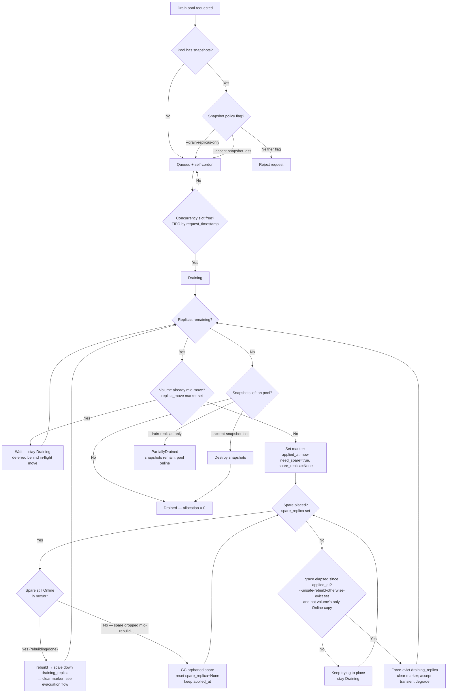
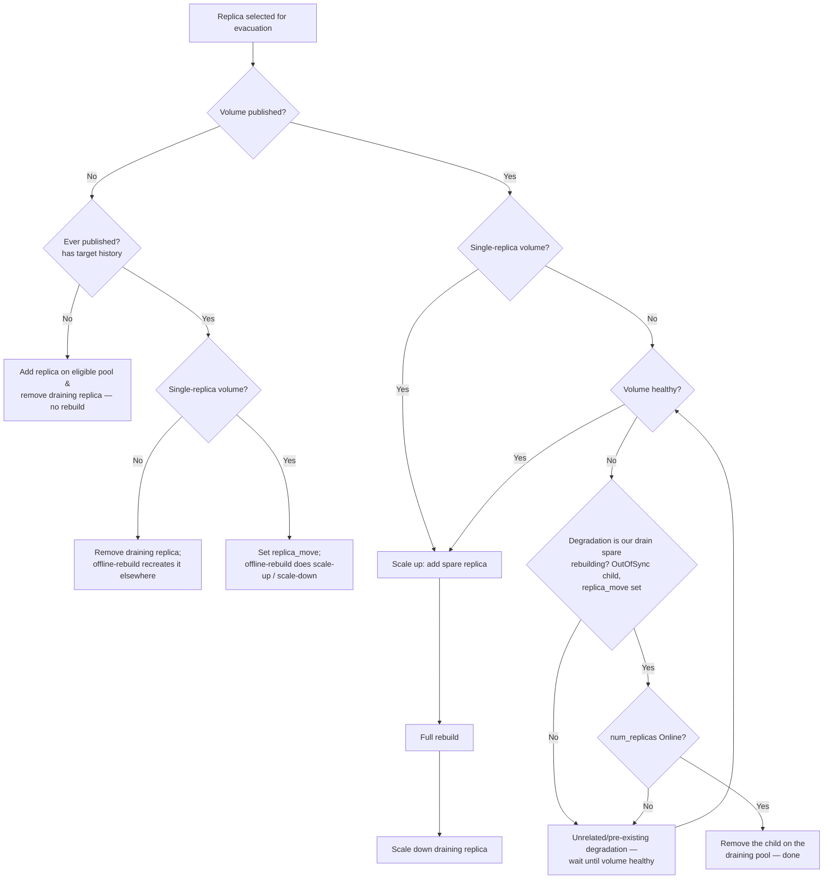

# Online Pool Drain

## Table of Contents

- [Summary](#summary)
- [Motivation](#motivation)
  - [Goals](#goals)
  - [Non-Goals](#non-goals)
- [Proposal](#proposal)
  - [User Stories](#user-stories)
  - [Implementation Details/Notes/Constraints](#implementation-detailsnotesconstraints)
- [Drawbacks](#drawbacks)
- [Future Improvements](#future-improvements)
- [Testing](#testing)

## Summary

Pool Drain allows administrators to move all storage resources off a DiskPool before decommissioning
a pool or node, while the pool (and its node) stay **online** and continue serving I/O throughout.
When an user drains a pool, every volume replica residing on the pool is migrated to eligible
pools while respecting topology constraints; once the pool's replica allocation reaches zero (or all
targeted resources are evacuated) the pool transitions to a `Drained` state.

The feature is modeled end-to-end on the existing **node drain** and reuses the existing volume
scale-up / scale-down and replica rebuild mechanisms. Migration preserves full volume redundancy by
default by over-replicating a volume by one for the duration of each rebuild rather than the
faster-but-degrading approach of removing a replica and letting a hot-spare rebuild from a reduced
copy set. The operation is exposed through a new Pool Drain API across the stack — REST, gRPC, and
the `kubectl mayastor` plugin — and is driven asynchronously by a dedicated reconciler and a
persisted drain state machine.

Users interact with it via `kubectl mayastor drain pool <id>` (and `PUT /pools/{id}/drain`). The
feature includes abort support, progress visibility, a dry-run pre-flight analysis, a cluster-wide cap
on concurrent pool drain operations, an optional forced-eviction policy for replicas that have no
valid destination, and an explicit policy for handling snapshots left behind on a drained pool.

## Motivation

Today OpenEBS Mayastor supports volume scale-up, volume scale-down, and replica rebuilds, and the
control plane can **cordon** a pool (block new replicas) and **drain a node** (move volume targets
off a node). However, there is no mechanism to evacuate an entire pool — to move all existing
replicas off one pool to other pools so the pool can be retired or serviced. This feature builds on
the existing scale-up/scale-down and rebuild capabilities to provide that.

This is required for administrators wishing to:

- Decommission storage
- Replace hardware
- Remove a node
- Rebalance capacity

Pool Drain automates this process while ensuring volume availability is maintained, existing rebuilds
are not disrupted, topology constraints are preserved, and the pool reaches zero replica allocation.

### Goals

- Drain a pool while it stays **online** by default, with **no data unavailability** for the volumes whose
  replicas are migrated.
- Support evacuation of every volume scenario: single-replica published, multi-replica, unpublished,
  and degraded volumes.
- Provide an explicit, user-chosen **snapshot policy** for snapshots that remain on a drained
  pool.
- Provide **abort** support to cancel a queued or in-progress drain.
- Provide **progress visibility** for a drain in flight.
- Provide a **dry-run** pre-flight analysis that reports what a drain would do without mutating state.
- Rate-limit concurrent pool drains **cluster-wide** to avoid oversubscribing rebuild bandwidth.
- Optionally **force-evict** replicas that have no valid destination after user specified Duration elapses
  so a drain cannot stall indefinitely — never evicting a volume's only online copy.

### Non-Goals

- **Snapshot evacuation** (moving snapshots with their replicas to another pool) is out of scope for
  Phase 1. Phase 1 only moves replicas; snapshots are either left behind or destroyed per the chosen
  policy. True snapshot evacuation is deferred to Phase 2 which will commence after Phase 1 is code complete.
- A **per-node** rebuild concurrency cap is out of scope (left as an open question); only
  cluster-wide and per-pool concurrency limits are introduced.

## Proposal

A drain request lands the pool in a persisted `Queued` state and immediately self-cordons the pool
(blocking new replicas, snapshots, and restores from landing on it). A dedicated reconciler on pool
module will promote queued pools to `Draining` in FIFO order, up to a configurable `--pool-drain-limit`.
A dedicated pool-drain reconciler then migrates every replica off each draining pool, one
rebuild at a time. It sets ReplicaMoveConfig in VolumeSpec, Thus triggering a Full rebuild.
When the rebuild completes, associated volume replica from the `Draining` pool is removed. When
the pool's replica allocation reaches zero, the pool transitions to `Drained` (or `PartiallyDrained`
when snapshots are intentionally left behind).

The drain is driven by a `DrainPhase` state machine, with its data split across the pool spec and the
pool state. The drain request and user policy are recorded in a **`DrainSpec`** carried on its own new
`PoolSpec.drain_spec` field (separate from the existing `cordon_drain` user-cordon field); the
current `DrainPhase` and progress metrics live in a **`DrainProgress`** on the pool state
(`PoolState.drain_runtime.drain_progress`). The `DrainSpec` holds the self-cordon applied at admission plus a
**`DrainArgs`** with the user policy, which holds:

- `request_timestamp` — when the drain was applied; used for FIFO promotion out of the queue.
- `accept_snapshot_loss` / `drain_replicas_only` — the user-chosen snapshot policy flags.
- `unsafe_rebuild_otherwise_evict` — the forced-eviction policy: an optional grace period after which
  a replica that has no placement candidate is force-evicted. `None` disables forced eviction;
  `Some(d)` force-evicts after waiting `d`. The value must be **strictly positive** — `Some(0)` is
  **rejected at admission with an error**; immediate eviction is a separate, explicit option
  (`unsafe_evict`) rather than a zero grace on this field. To disable forced eviction the user simply
  omits the flag.
- `unsafe_evict` — a boolean that skips the safe over-replicate flow and evicts replicas directly,
  accepting a transient degraded rebuild; never evicts a volume's only `Online` copy. Exposed on
  REST/gRPC and, in the plugin, as a **hidden** flag (registered but omitted from `--help` and the
  generated docs) so it is reachable by power users who know it but not discoverable by casual CLI use.

`DrainProgress` carries the current `DrainPhase` plus a set of baseline metrics captured once at queue
time and persisted to etcd (keyed by pool id):

- `initial_replica_count` — number of replicas on the pool when the drain was admitted.
- `initial_snapshot_count` — number of replica snapshots on the pool at admission.
- `initial_allocation` — capacity allocated on the pool at admission (bytes).
- `initial_committed` — capacity committed (sum of all replica size) on the pool at admission.

These baseline values are immutable for the life of the drain and must be persisted (the live counts
alone cannot tell how much has drained); current replica/snapshot/allocation counts are read live
from the data plane on each progress query and compared against the baseline to report how far the
drain has progressed. The `DrainPhase` state machine has the states:

- `Queued` — admitted, self-cordoned, awaiting a concurrency slot. The pool with the longest time
  elapsed in the queue is picked first.
- `Draining` — actively migrating replicas.
- `Drained` — replica allocation reached zero (terminal).
- `PartiallyDrained` — replicas evacuated, snapshots intentionally left behind (reported when
  allocation cannot reach zero because snapshots remain).
- `Aborted` — a transient cleanup phase entered when a drain is cancelled. `drain_spec` is **retained**
  (with `phase = Aborted`) throughout cleanup — it is *not* cleared up front — so the pool stays
  discoverable and self-cordoned while a dedicated cleanup reconciler undoes the drain's changes on
  affected volumes (if any). Only once cleanup completes is `PoolSpec.drain_spec` cleared (which
  removes the drain's self-cordon with it) along with the `DrainProgress` record, while any user
  cordon in `cordon_drain` is left untouched. Unlike `Drained`, this is not a retained terminal
  state — once cleanup completes the drain record is gone.

**Pre-requisites:** the pool must be `Online` and must not already be in a `Queued`, `Draining`, or
`Aborted` state. Blocking on `Aborted` too means a fresh drain cannot start until the previous
drain's cleanup has fully torn down (`drain_spec` deleted), which serializes the two and prevents a
new drain's `replica_move` markers from being confused with the aborting drain's leftovers.

### User Stories

#### Story 1 — Decommission a node's storage

An administrator needs to remove a node from the cluster. This feature will be tied with node drain
feature but not in the scope of Phase 1. Administrator can drain each pool on the node with
`kubectl mayastor drain pool <id>`. Each pool's replicas are migrated to other pools elsewhere in the
cluster with full redundancy maintained throughout. They poll `kubectl mayastor get-drain-progress pool <id>`
and watch the replica count fall to zero, at which point the pool reports `Drained` and the node can be safely removed.

#### Story 2 — Drain a pool holding snapshots

An administrator drains a pool that holds replica snapshots. Because snapshots cannot be migrated in
Phase 1, the request is **rejected** unless they pick a policy: `--drain-replicas-only` (move
replicas, leave snapshots in place; pool ends `PartiallyDrained` and stays online serving them) or
`--accept-snapshot-loss` (move replicas, then destroy the remaining snapshots; pool allocation
reaches zero).

#### Story 3 — Abort a drain in progress

An administrator starts a drain, then changes their mind. They run `kubectl mayastor uncordon
pool <id> --drain` (there is no separate abort command — cancelling a drain is just uncordoning it
with the drain scope). Already-evacuated replicas stay put, in-flight unrelated
rebuilds are untouched, and the drain's own half-rebuilt spare replicas are unwound. Once that cleanup
finishes the drain record (`DrainSpec`/`DrainProgress`) is cleared — which also lifts the drain's
self-cordon — while any cordon the user applied themselves stays in place, so the pool returns to
exactly the cordon state it had before the drain.

### Implementation Details/Notes/Constraints

#### Evacuation strategy: over-replicate vs fast-remove

For a multi-replica volume we could simply remove the replica from the draining pool, which would
trigger a full rebuild elsewhere instantly — pool allocation would drop quickly and the pool would
reach `Drained` fast. The drawback is that we lose a data copy and the volume runs **Degraded** for
the duration of the rebuild, which is an availability/durability regression.

Instead, drain uses a **scale-up / scale-down** technique: add a new replica on an eligible pool,
wait for its rebuild to complete, then scale down by removing the replica on the draining pool. The
volume keeps its full redundancy the whole time, at the cost of a slower drain (each move waits for a
rebuild) and one extra replica's worth of transient space. This *slower-but-never-degraded* trade-off
is the core design choice; the fast-remove path is explicitly rejected for published volumes.

Because the scale-up adds a replica *above* the volume's configured replica count, the drain must be
able to tell that the extra replica is one it created. This is tracked as a managed `replica_move`
marker on the volume's runtime metadata (`VolumeSpec.metadata.runtime`), persisted across restarts
via the pool's `PoolDrainRecord` (see below), initialized when a drain-move begins to start
Full rebuild (over-replicate) and once rebuild completes and spare child is Online, `replica_move`
is cleared to kick start scale-down procedure. Existing replica-count-specific reconcilers may need changes
to cooperate with this marker.

#### Drain workflow and state machine

Pool drain is an asynchronous operation carried out by reconcilers, like most async operations in the
core agent. When the user issues a drain, the pool's `DrainPhase` is set to `Queued` and the pool
self-cordons immediately. The reconciler evaluates the number of pools already `Draining` against the
configurable pool-drain-limit limit and promotes queued pools to `Draining`, preferring the pool
that has waited longest. The reconciler's goal is to bring the pool's current replica count and
current capacity allocation to zero; when that happens the pool is marked `Drained`. If snapshots
remain (and the policy left them in place), the pool is marked `PartiallyDrained` since allocation
will not reach zero. If the user uncordons the drain (`uncordon pool <id> --drain`) on a Pool which
is in `Queued` or `Draining` state, then the `DrainPhase` is set to `Aborted`.

#### Drain lifecycle and policy flags

The per-replica evacuation flow below answers "how is *one* replica moved". At the pool level, the
three policy flags (`--drain-replicas-only`, `--accept-snapshot-loss`, `--unsafe-rebuild-otherwise-evict`) operate at two
different altitudes: the snapshot policy gates **admission** (reject if snapshots exist and neither
flag is set) and decides the **terminal state** (`Drained` vs `PartiallyDrained`), while `--unsafe-rebuild-otherwise-evict`
fires only at the per-replica "no eligible destination" branch. This pool-level view threads all three
through the lifecycle; Refer below flow chart to understand how these flags control the workflow.



#### Abort support

There is no dedicated abort command — a user cancels a drain by uncordoning it with the drain scope
(`uncordon pool <id> --drain`), which enters the same cleanup path. The pool's `DrainPhase` is first
set to `Aborted`, which drives the undo of
the drain's changes on affected volumes (if any): already-evacuated replicas stay evacuated, ongoing
unrelated rebuilds are not changed, and any extra replica the drain added is unwound — the
`replica_move` marker is cleared, and if a rebuild was still in flight the
scale-down removes the half-rebuilt (degraded) spare rather than a healthy copy. Once that cleanup
completes, the drain is torn down by clearing `PoolSpec.drain_spec` (`drain_spec = None`) and the
`DrainProgress` on `PoolState`. Because the drain's self-cordon lives *inside* `drain_spec`, dropping
that field removes the self-cordon automatically — while any **user** cordon in `cordon_drain` is
left completely intact, since abort never touches that field. So a pool the user had independently
cordoned falls back to exactly that cordon; a pool cordoned only by the drain rejoins scheduling as a
normal pool. Either way no stale drain stats are retained once the pool serves new resources again.

#### Evacuation candidates

The reconciler enumerates every replica on the draining pool and handles it according to the owning
volume's scenario.

**Multi-replica volume.** The most straightforward scenario. Add a new replica on an eligible pool
and let the hot-spare/rebuild machinery carry out the full rebuild; once the new replica is fully
rebuilt, scale down by removing the child on the draining pool. The volume never drops below its
configured redundancy.

**Degraded volume.** We must be careful not to disrupt existing rebuilds or Remove Online copies
which may decrease Availability.

- If any child of the volume is `Degraded` or `Faulted` for an unrelated reason, **wait** before
  starting the drain-move — do not stack a second rebuild on an already-degraded volume.
- A degraded child that *we* created via the drain scale-up is the expected mid-rebuild state and is
  **not** a reason to wait; the design distinguishes "our rebuilding spare" from a pre-existing
  degradation. We may proceed to remove the Degraded or OutOfSync child if `num_replicas` is Online.
  Ensure that `replica_move` is in effect.
- Before removing the source replica on the draining pool, confirm it is **not acting as the rebuild
  source** for another (non-drain) rebuild. If it is, refrain from removing it until that rebuild
  completes — removing a live rebuild source would fault the destination. If it is not a source, the
  replica on the draining pool can be removed.

**Single-replica published volume.** We scale up the volume (add a new replica and rebuild it). Once
the new replica is fully rebuilt, we scale down by removing the replica on the draining pool.

**Unpublished volume.** There is no live nexus through which to rebuild, so these are handled by
reusing the existing offline-rebuild (temporary-nexus) mechanism; changes are required there to drive
it from the drain path:

- For a **multi-replica** unpublished volume, remove the replica from the draining pool and let the
  offline-rebuild feature recreate it elsewhere.
- For a **single-replica** unpublished volume, set the `replica_move` configuration; the offline-rebuild
  feature performs the scale-up / scale-down as above.
- If the volume was **never published**, there is no data to rebuild, so we may simply add a new
  replica and remove the draining-pool replica **without a rebuild**.

**Snapshot replicas.** Snapshots cannot be migrated in Phase 1, and moving a snapshotted replica
preserves its snapshots on the pool. The user chooses a policy via mutually-exclusive flags that
govern only the snapshots left behind:

- `--accept-snapshot-loss` — move all replicas, then destroy the remaining snapshots on the pool.
  Pool allocation reaches zero and the pool reaches `Drained`.
- `--drain-replicas-only` — move all replicas, leaving any snapshots in place. The pool reaches
  `PartiallyDrained` with non-zero allocation and stays online serving the snapshots; the user
  can later create volumes from those snapshots once the pool is uncordoned. Because allocation
  stays non-zero, a subsequent `DestroyPool` still fails (*"please drain the diskpool before
  attempting destroy"*); to actually destroy such a pool the user re-drains with
  `--accept-snapshot-loss`, which removes the remaining snapshots.
- If the pool **has snapshots** and **neither** flag is provided, the drain request is **rejected** so
  the user must consciously choose a policy.

(If a volume has multiple replicas, the user retains the snapshot on the other replica. The
platform does not currently support having fewer snapshots than the replica count at volume creation
time — a community contribution toward this has been expressed, and true snapshot evacuation is
targeted in Phase 2.)

#### Volumes with self-heal disabled

The scale-up / scale-down machinery the drain reuses is driven by the hot-spare reconcilers, which
run for a volume **only when its policy has `self_heal` enabled**. A volume with self-heal disabled
would therefore never get its spare created, attached, and rebuilt automatically, and its replica on
the draining pool would never be evacuated — silently stalling the drain (allocation never reaches
zero).

The drain must not depend on `self_heal`. The drain reconciler owns the move end-to-end: it sets the
`replica_move` marker, drives the scale-up (create + attach the spare), waits for the rebuild,
then clears the marker and drives the scale-down of `draining_replica` — for **every** volume on the
pool regardless of its `self_heal` setting. `self_heal` governs unsolicited self-healing of a volume,
not an administrator-initiated evacuation, so a drain proceeds identically for self-heal-disabled
volumes. (The health-reporting rule below applies to them the same way.)

#### Volume health during a drain move

The over-replicate flow reuses the scale-up machinery, so while the drain's spare is rebuilding the
volume behaves exactly like any other volume with a child under rebuild. Volume status is **derived
from the nexus status** (`volume/registry.rs`) and the two **cannot differ**: for a published volume a
nexus with a child under rebuild reports `Degraded`, and that is propagated straight to the volume
status. During a drain move the volume therefore reports `Degraded` for the duration of the spare's
rebuild (and, once the nexus is `Online` again but before scale-down, while `children.len() !=
num_replicas`), then returns to `Online` when the move completes.

For Phase 1 we accept this and **mimic `nexus_state` for `VolumeState`** — the volume status is
whatever the nexus reports, with no drain-specific override. The `num_replicas` original copies stay
`Online` and keep serving I/O throughout, so this is a transient, self-inflicted `Degraded` during an
administrator-initiated move rather than a genuine loss of redundancy, but the reported status does not
try to distinguish the two.

> **Assessment task (open) — review Nexus health from io-engine before finalizing.** We must assess
> exactly what health the io-engine reports for a nexus with a drain spare rebuilding — the
> nexus/child states, rebuild progress, and any per-child rebuild-source/destination markers available
> — and decide whether we can *derive* a more accurate volume health from that richer io-engine signal
> (for example, distinguishing "an extra over-replicated copy is rebuilding" from "a real copy was
> lost"). Because nexus state and volume state cannot diverge, any improvement here must come from the
> io-engine-reported nexus health itself, not from a control-plane override layered on top. The
> outcome of this assessment decides whether Phase 1's mimic-`nexus_state` behaviour is the final
> approach or an interim one.

#### Volume operations during a drain (snapshot, restore, resize)

A volume may still hold a replica on the draining pool for most of the drain's lifetime, so we must
define how volume-level operations behave for such volumes while the drain is in flight. The rule
follows directly from the self-cordon: the drain blocks anything **new** from landing on the pool,
but never disturbs I/O to the copies already there.

- **Snapshot — blocked until the replica is evacuated.** A volume snapshot creates a replica-snapshot
  on *every* one of the volume's replicas, including the one on the draining pool. The self-cordon
  blocks new `snapshots` from landing on the pool, so a snapshot of a volume that still has a replica
  there is **rejected** until that replica has been migrated off. Once the replica is evacuated to an
  eligible pool the snapshot succeeds normally against the volume's remaining copies. (This is also
  why Phase 1 leaves existing snapshots behind rather than migrating them — see the snapshot policy
  flags.)
- **Restore (create volume from snapshot) — blocked until the replica is evacuated.** A restore
  recreates the volume from a snapshot, and that snapshot still lives on the replica on the draining
  pool (Phase 1 does not migrate snapshots). Since the source snapshot is pinned to the pool being
  emptied, a restore of such a volume is **rejected** until its replica — and the snapshot it carries
  — has been evacuated, mirroring the snapshot rule above. The draining pool is likewise never a
  placement candidate for the restored volume's new replicas, per the self-cordon's `restores` bit.
- **Resize — allowed throughout, as long as the replicas are accessible.** A resize grows the
  volume's *existing* replicas in place; it does not create a new replica, snapshot, or restore on the
  pool, so the self-cordon does not block it. Because the draining pool stays **online** and keeps
  serving I/O for the whole drain, the replica on it remains accessible and the resize applies to it
  like any other copy. Resize therefore works normally during a drain — it only fails if a replica is
  genuinely inaccessible (e.g. its node/pool is offline), which is not a condition the drain itself
  introduces.

In short: operations that depend on **new or pinned** state on the draining pool (snapshot, restore)
are rejected and wait for the replica to leave, while operations that only touch **already present**
replicas (resize, and of course ongoing I/O) proceed unaffected.

#### Unplaceable replicas and forced eviction

A replica may have **no eligible destination** — there may be no other pool with enough free space, a
matching cluster size, or a placement that satisfies the volume's topology / anti-affinity
constraints. For a `need_spare` move that means the spare never gets placed, `spare_replica` stays
`None`, and the volume keeps the pool in `Draining` indefinitely. To bound this, the user can opt into
forced eviction with `--unsafe-rebuild-otherwise-evict <duration>`, a **per-replica** grace interval.

The grace is anchored on the marker itself (`DrainConfig.applied_at`), so each move is timed
independently. When the reconciler begins a `need_spare` move it sets the marker with
`applied_at = now` and `spare_replica = None`, then the self-heal loop tries to place and create the
spare:

- **Placed:** `spare_replica` is populated, its rebuild runs, and on completion `draining_replica` is
  scaled down and the marker cleared. No eviction.
- **Not placed within the grace:** once `now - applied_at >= grace` with `spare_replica` still `None`,
  the replica is treated as unplaceable and `draining_replica` is force-evicted directly — no spare
  was ever created, so there is nothing to unwind — after which the marker is cleared. This accepts a
  transient degraded rebuild rather than stalling the drain.

Because `applied_at` is stamped when the move *begins* (i.e. when this replica becomes the volume's
active move, not while it sits deferred behind a sibling), each replica gets its **own full grace
window** regardless of how long it waited its turn. The grace period must be **strictly positive**: a
zero duration is **rejected at admission with an error**, since it would conflate "wait then evict"
with "evict immediately" on the same field — immediate eviction is instead a separate, explicit option
(`unsafe_evict`, below). If forced eviction is disabled (the flag omitted), a `need_spare` move whose
spare cannot be placed simply waits **indefinitely** — never degrading the volume — until a
destination frees up or the drain is aborted.

As a hard safety rule — and the **only** guard on any eviction — a replica is **never** removed when
it is the volume's last `Online` child, since that would cause data unavailability. This applies
identically to both eviction paths: timeout-driven forced eviction (the `--unsafe-rebuild-otherwise-evict`
grace elapsed with no spare placed) and direct `unsafe_evict`. There is no additional precondition —
in particular, an eviction does **not** require that a placement candidate exist for the recreate; the
caller has already accepted a degraded (and possibly open-ended, until a destination frees up) rebuild.
By default (when neither `--unsafe-rebuild-otherwise-evict` nor `unsafe_evict` is set) the design never
degrades a volume to make progress at all: a pool with an unplaceable replica stays `Draining` until
the user either frees a destination or aborts.

**A deferred sibling is never force-evicted.** Because a volume holds at most one marker, only the
replica named in that marker's `draining_replica` is the active move, and only it is subject to the
grace/eviction logic above. Any *other* replica of the same volume — e.g. one on a second pool being
drained concurrently — has no marker and no running `applied_at` timer, so it is simply deferred and
can never be force-evicted while a sibling's move is in flight. The eviction path only ever removes
its own marker's `draining_replica`, so it can never touch a marker belonging to another replica's
move.

**Direct unsafe eviction (`unsafe_evict`).** For power users who explicitly accept
the durability trade-off, a separate boolean option skips the safe over-replicate flow entirely and
evicts replicas **directly** — removing the child on the draining pool and letting the normal rebuild
machinery recreate it elsewhere degraded, rather than over-replicating first. This is the
fast-but-degrading path deliberately rejected as the *default*, offered here as an opt-in escape
hatch to drain faster or to make progress when over-replication is undesirable. It differs from
`unsafe_rebuild_otherwise_evict` in two ways: it applies to **every** replica (not just unplaceable
ones), and it acts **immediately** (no grace period). The same hard safety rule still holds — a
volume's only `Online` copy is never evicted. Because it trades durability for speed, on the plugin
this option is exposed as a **hidden** flag — clap's `#[arg(hide = true)]`, so it is present and fully
functional (power users who know it can pass it) but omitted from `--help` and the generated CLI docs,
not a separate build feature-gate (it is a normal, documented option on the REST/gRPC API). When
`unsafe_evict` is set, `unsafe_rebuild_otherwise_evict` is redundant and ignored.

Despite skipping over-replication, `unsafe_evict` is **serialised per volume exactly like the safe
flow**, through the same single-slot `replica_move` marker — set with `need_spare = false`. It
removes `draining_replica` directly, then **holds** the marker until the volume is healthy again (the
self-heal-recreated copy is `Online`/clean and the volume is back to `num_replicas`), and only then
clears it. Because `need_spare = false` derives `effective_replica = num_replicas`, the self-heal loop
recreates the removed copy rather than adding an extra one, and `spare_replica` is left unused.
Holding one marker slot per volume guarantees at most one of the volume's replicas is in flight at a
time, so two concurrently-draining pools can never drop the same volume through two simultaneous
direct evictions (e.g. 3 → 1).

#### Spare fails mid-rebuild

A `need_spare` move can be interrupted after the spare is placed but before its rebuild completes: the
spare replica's node or pool goes down while the child is still rebuilding. Because a rebuilding child
carries **no rebuild/write log**, the nexus does not wait for it to return — it is dropped from the
nexus outright, and even if that exact replica later came back it would need a *fresh full rebuild*,
not a log-based catch-up. Critically, this is **not** a loss of redundancy: the spare is the extra,
over-replicated copy, and all `num_replicas` original copies (including `draining_replica`) stayed
`Online` throughout. Only the in-flight over-replication attempt was lost.

The move therefore recovers by **resetting the marker's `spare_replica` to `None`** rather than
waiting on the dead child. This is the missing transition from the placed state: the reconciler
detects `spare_replica.is_some()` while that child is no longer present/`Online` in the nexus, and
resets it. Since `need_spare` stays `true`, `effective_replica` remains `num_replicas + 1`, so the
drain loop re-enters the placement branch and schedules a **fresh spare — possibly on a different
eligible pool** — starting a new full rebuild. No new phase is needed; the move simply falls back to
"not placed yet."

Volume health is unaffected by this recovery: it simply follows the nexus status (see *Volume health
during a drain move*), reporting `Degraded` while any spare — the dropped one or its fresh replacement
— is rebuilding, and returning to `Online` once the move completes.

#### Flow chart for evacuation



#### Dry-run

The user can set a dry-run flag on the drain request. The service runs the same candidate
selection the real drain would use for every replica and returns an analysis — total replicas,
snapshot count, degraded count, and the number of replicas with no valid destination broken down by
cause (insufficient free space vs. topology/anti-affinity constraints) — **without** queuing,
migrating any replica, or involving the reconciler.

The dry-run is purely read-only: it **does not self-cordon** the pool and leaves no state behind, so
the pool is exactly as it was when the call returns. The result is therefore a point-in-time snapshot
— because the pool is not cordoned during the analysis, the scheduler may land new replicas on it
while candidates are evaluated, and by the time the real drain runs new replicas may have arrived or
capacity freed by concurrent drains elsewhere may have been consumed.

Crucially, the **scheduling possibilities can change between the dry-run and the actual drain
execution**: cluster state that feeds candidate selection — per-pool free capacity, node/pool
cordon and online status, topology labels, and anti-affinity placement of a volume's other replicas
— is evaluated against a live cluster at two different points in time. A destination the dry-run
reported as available may be full, cordoned, or offline when the drain runs, and conversely a replica
the dry-run flagged as unschedulable may gain a valid destination if capacity frees up in the interim.
The dry-run therefore gives an **idea of the likely impact** — how many replicas would move, how many
would have no valid destination and why — rather than a binding plan the real drain is guaranteed to
reproduce. It is guidance, not a guarantee.

#### Progress visibility

A drain spans many reconciler ticks and minutes of rebuild, so users get read-only visibility.
The baseline metrics (`initial_replica_count`, `initial_snapshot_count`, `initial_allocation`,
`initial_committed`) are
captured once at queue time and persisted in `DrainProgress` on the pool state; current values are
computed live from the data plane on each query and compared against the baseline, keeping the
reconciler free of progress bookkeeping. Progress is exposed via a get-drain-progress API and the `kubectl mayastor
get-drain-progress pool <id>` command.

#### Cluster-wide pool drain limit

Draining many pools at once would oversubscribe rebuild bandwidth and risk availability, so drains
are rate-limited cluster-wide via a configurable `--pool-drain-limit`. A request is
admitted into `Draining` only when the number of pools already `Draining` is below the limit; queued
pools are promoted in FIFO order by request timestamp, which guarantees no queued pool is starved.
The cluster-wide rebuild backpressure remains a finer second line of defense that throttles
individual rebuilds.

#### Resource model changes

The drain state is split across the **pool spec** (the request and user policy) and the **pool
state** (the live phase and progress metrics).

On `PoolSpec`, the drain lives on its **own new field** — the existing `cordon_drain` field (which
carries the *user* cordon) is left untouched, so currently-cordoned pools and all existing cordon
code paths are unaffected. This makes the change fully additive: old specs deserialize with
`drain_spec = None`, and the field is only written once a drain exists. The `DrainSpec` bundles the
self-cordon the drain applies at admission with a `DrainArgs` carrying the user policy and the
`request_timestamp` the reconciler uses for FIFO promotion out of the queue:

```rust
pub struct PoolSpec {
    // ...
    /// User-applied cordon.
    #[serde(skip_serializing_if = "Option::is_none")]
    pub cordon_drain: Option<CordonDrainState>,
    /// Desired drain: self-cordon + drain policy.
    #[serde(default, skip_serializing_if = "Option::is_none")]
    pub drain_spec: Option<DrainSpec>,
}

/// Desired drain recorded on `PoolSpec`: the self-cordon applied at admission plus
/// the user-chosen policy. Held on its own field, separate from the user-applied
/// `cordon_drain`.
pub struct DrainSpec {
    /// Self-applied cordon, set when the drain request is admitted.
    pub self_cordon: CordonedState,
    /// User-chosen drain policy plus the request timestamp.
    pub args: DrainArgs,
}

/// User-chosen drain policy plus the request timestamp used for FIFO queue promotion.
pub struct DrainArgs {
    /// When the drain was applied; used for FIFO promotion out of the queue.
    pub request_timestamp: SystemTime,
    /// Destroy snapshots left on the pool once all replicas are evacuated.
    pub accept_snapshot_loss: bool,
    /// Move replicas only, leaving snapshots in place.
    pub drain_replicas_only: bool,
    /// Grace period after which an unplaceable replica is force-evicted.
    /// `None` disables forced eviction entirely. Must be a strictly positive
    /// duration when set; a zero duration is rejected at admission.
    pub unsafe_rebuild_otherwise_evict: Option<Duration>,
    /// Skip the safe over-replicate flow and evict replicas directly, accepting a
    /// transient degraded rebuild. Never evicts a volume's only `Online` copy.
    /// A normal option on the REST/gRPC API; in the CLI it is registered as a hidden
    /// flag (`#[arg(hide = true)]`) — reachable but omitted from `--help` and docs.
    pub unsafe_evict: bool,
}
```

Because cordon-ness is now split across two fields, scheduling decisions must consult an
**`effective_cordon()`** that ORs the two `CordonedState` bitmaps per resource — the user cordon in
`cordon_drain` and the drain's `drain_spec.self_cordon`. A resource is blocked if **either** bitmap
blocks it. Concretely, the drain's `self_cordon` blocks new `replicas`, `snapshots`, and `restores`
(nothing new should land on a pool being emptied) but deliberately leaves `import = false`: a
draining pool must still be importable so it can be brought back online after a node/engine restart
and continue serving I/O while it drains. The user cordon retains full say over imports — if the
user cordoned the pool with `import = true`, `effective_cordon().import` stays `true` and the pool
remains blocked for imports, since the OR keeps whichever field is more restrictive. So the drain
never *relaxes* a user-imposed import block; it only refrains from adding one of its own.

On the volume's runtime metadata (`VolumeSpec.metadata.runtime.replica_move`, an
`Option<ReplicaMoveConfig>` held in `VolumeRuntimeMetadata`), a managed `replica_move` marker records
that a drain move for the volume is in flight. `VolumeRuntimeMetadata` is `#[serde(skip)]` and so is
not persisted with the `VolumeSpec`; the marker is instead persisted on the pool's `PoolDrainRecord`
as a `Vec<ReplicaMoveConfig>` (etcd, keyed by pool id). Each `ReplicaMoveConfig` carries the
`VolumeId` of the volume it belongs to (on `DrainConfig`), so after a core-agent restart the runtime
marker is rebuilt by iterating that Vec and applying each entry to the matching volume's
`replica_move` slot. Persisting the moves on the pool record — the same record that carries the drain
baseline and phase — keeps all of a drain's resumable state in one place, keyed by the pool being
drained.

> **Invariant — the runtime marker and its persisted entry are kept in lock-step.** The
> `runtime.replica_move` slot (`VolumeRuntimeMetadata`) and the matching entry in
> `PoolDrainRecord.replica_moves` are two representations of one logical state and MUST be mutated
> together in a single operation: setting the runtime marker persists the `ReplicaMoveConfig` to the
> pool record first, and clearing the runtime marker removes it from the record — never one without
> the other. The pairing is keyed by `(DrainConfig.pool, DrainConfig.volume)`: the pool id selects the
> `PoolDrainRecord`, the volume id selects the entry within its `replica_moves`. Restart rehydration
> is the *only* path that writes the runtime slot from the record; steady-state code always goes
> record-first so a crash between the two writes leaves the durable record authoritative, and the
> runtime slot is simply rebuilt from it on the next start. Because a volume holds at most one
> `replica_move`, `replica_moves` contains at most one entry per `VolumeId`, so rehydration and clears
> can match by volume id without ambiguity.

The self-heal loop reads `effective_replica = num_replicas (user-defined) + N`, where `N` is
**derived** from the marker rather than stored: for a `PoolDrain` move `N = 1` when `need_spare` is
true (over-replicate) and `N = 0` when it is false (direct `unsafe_evict`, which recreates the removed
copy rather than adding one). In the `need_spare` case, once the spare's full rebuild completes the
marker is cleared so `effective_replica` returns to `num_replicas` and the scale-down removes
`draining_replica`. The marker also carries both replica identities: `draining_replica` (the child on
the draining pool, removed when the move completes) and `spare_replica` (the over-replicated copy,
populated once scheduled — `None` until then, and unused when `need_spare` is false). Recording
`draining_replica` lets the scale-down target the correct child rather than letting the self-heal loop
pick an arbitrary one.

**Serialisation of moves per volume (concurrency).** A volume carries **at most one**
`replica_move` at a time, and this single-slot marker is what serialises drain moves for a
volume. Before starting a move for any replica on a draining pool, the drain reconciler checks the
owning `VolumeSpec`: if `replica_move.is_some()`, a move for that volume is already in flight, so
the reconciler **defers** this replica and does not add a second marker — it retries on a later tick
once the in-flight move has cleared the marker. **When the marker clears depends on the mode:** a
`need_spare` (over-replicate) move clears it after the spare has rebuilt and `draining_replica` is
scaled down; a direct `unsafe_evict` move (`need_spare = false`) **holds** the marker until the volume
is healthy again — the self-heal-recreated copy is `Online`/clean and the volume is back to
`num_replicas` — and only then clears it. Holding the unsafe marker across the degraded rebuild is
what actually serialises it: releasing it the moment `draining_replica` is removed would let a sibling
on another draining pool evict immediately and drop the volume two copies at once. This matters when two of a
volume's replicas sit on two different pools being drained **concurrently** (or when one pool-drain
must evacuate two replicas of the same volume): the moves are naturally taken one at a time rather
than stacking two simultaneous rebuilds on the same volume. Concurrency is bounded at three levels:
this per-volume single marker bounds it *within* a volume; a **per-pool move limit** (next section)
bounds how many replicas a single pool moves at once; and the cluster-wide `--pool-drain-limit` plus
rebuild backpressure bound it *across* pools.

**Per-pool concurrency limit — the `ResourceMove` admission gate.** Each pool has a user-configured
limit on how many of its replicas may be moving concurrently. Without it a single busy pool could
enqueue moves for all its replicas at once and, since the rebuild limit is **global**, starve every
other pool's rebuilds — the per-volume marker doesn't help here because each move is on a *different*
volume. The limit caps a pool's in-flight moves so no one pool oversubscribes the shared rebuild
budget. It is a **global configuration flag applied uniformly to every pool** (like the cluster-wide
`--pool-drain-limit`), not a per-pool value stored in the `PoolDrainRecord`; it is enforced by
counting the entries currently in that pool's `replica_moves` and refusing a new move once the count
reaches the configured limit.

Admission is expressed as a `ResourceMove` operation trait implemented by **both** `VolumeSpec` and
the pool (the `store::PoolState` wrapper that owns the `PoolDrainRecord`). The drain reconciler asks
the *volume* to move a replica; `VolumeSpec`'s `ResourceMove` impl first applies the per-volume
single-slot check (defer if `replica_move.is_some()`), then **delegates to the owning pool's**
`ResourceMove` impl to claim a slot. The pool impl is the one place that mutates
`replica_moves`: a single add/remove helper appends (or removes) a `ReplicaMoveConfig` and performs
the etcd write. If the pool is **at limit** the enqueue is refused and the volume defers to a later
tick; **only if the enqueue succeeds** (entry persisted to the record) does the caller then set the
volume's `runtime.replica_move` marker. That ordering is exactly the record-first rule from the
invariant above — the pool's persisted `replica_moves` is the source of truth, and the runtime slot
is set only after the durable write lands (and rebuilt from it on restart). Clearing a move runs the
reverse path through the same helper: remove the entry (etcd write), then clear the runtime marker.

The `requester` field currently has only `PoolDrain` as of now. It will be extended in future. We may use
over-replication in features like capacity rebalancing, Moving volumes to a specific type of Pool or converting
volume from thick -> thin visa-versa.

```rust
pub struct VolumeRuntimeMetadata {
    // ...
    /// Set while a drain move for this volume is in flight (over-replicate or
    /// direct evict). At most one is present at a time — the single slot is what
    /// serialises drain moves for the volume (a second move defers until cleared).
    pub replica_move: Option<ReplicaMoveConfig>,
}

/// A single in-flight replica move. Held on `VolumeRuntimeMetadata.replica_move`
/// (at most one per volume) and persisted via `PoolDrainRecord.replica_moves`.
pub struct ReplicaMoveConfig {
    /// Which feature requested the move, plus its per-feature data.
    /// The number of extra replicas is *derived* from the requester rather than
    /// stored — for `PoolDrain`, 1 when `need_spare` is set, else 0.
    pub requester: ReplicaMoveRequester,
}

/// The feature that requested a replica move, carrying its per-feature data.
pub enum ReplicaMoveRequester {
    PoolDrain(DrainConfig),
    // Extended in future (e.g. capacity rebalancing, pool-type migration, thick<->thin).
}

/// Per-replica state for a pool-drain move.
pub struct DrainConfig {
    /// When this move began, i.e. when the marker was set for `draining_replica`.
    /// Anchors the per-replica forced-eviction grace period.
    pub applied_at: SystemTime,
    /// Volume this move belongs to. Persisted (via `PoolDrainRecord.replica_moves`) so
    /// that on restart the runtime `replica_move` marker can be re-applied to the
    /// matching volume by filtering on this id.
    pub volume: VolumeId,
    /// Replica on the draining pool. When `need_spare` is true it is removed once the
    /// move completes; when false it is removed first, which triggers the rebuild.
    pub draining_replica: ReplicaId,
    /// Pool being drained (where `draining_replica` lives). Kept explicit so the move
    /// can be dequeued from the correct `PoolDrainRecord` even after `draining_replica`
    /// has been deleted, and so the runtime and persisted copies stay identical. The
    /// node is derived from the pool via the registry rather than stored.
    pub pool: PoolId,
    /// Move mode. `true` = safe over-replicate (add a spare, rebuild, then scale down
    /// `draining_replica`); `false` = `unsafe_evict` (remove the copy directly and let
    /// self-heal recreate it, accepting a transient degraded rebuild). Derives the number
    /// of extra replicas: 1 when true, 0 when false.
    pub need_spare: bool,
    /// The over-replicated spare created for this move; only meaningful when
    /// `need_spare = true`. `None` until the spare has been scheduled/created.
    pub spare_replica: Option<ReplicaId>,
}
```

Drain progress is **control-plane-derived** state, so it lives on the control plane's own
`store::PoolState` wrapper rather than in `transport::PoolState` — the latter is purely what the
io-engine reports and knows nothing about drains. The wrapper already embeds
`pool: transport::PoolState` (the dataplane-reported view); we add a
`drain_runtime: Option<PoolDrainRuntime>` alongside it for control-plane-owned runtime state, and
`DrainProgress` hangs off that. (We deliberately do *not* reuse the name `CtrlPoolState` here — that
type already exists in `transport::pool` and wraps `PoolState`; a second struct by the same name
would collide.)

Only the **baseline** needs a dedicated type. Current usage is *not* a separate struct — the live
replica count, snapshot count, allocation, and commitment are already carried by the embedded
`transport::PoolState` (`repl_count`, `snap_count`, `used`, `committed`) and are read straight off it
on each progress query, so `DrainProgress` exposes `current()` as a projection over `self.pool`
rather than storing a duplicate. The baseline (`PoolUsageStats`) is captured once at queue time and
**persisted to etcd** as a `PoolDrainRecord` keyed by pool id — persisting both the baseline and the
phase is what lets a drain resume from where it left off if the core agent restarts, since the live
counts alone cannot tell how much has already drained. Field names and `Option<u64>` shapes mirror
`transport::PoolState` so the baseline is captured with a trivial copy and no conversion:

```rust
/// Control-plane pool state: the io-engine-reported view plus control-plane-owned
/// runtime state. The `store::PoolState` wrapper, distinct from `transport::PoolState`.
#[derive(Serialize, Deserialize, Debug, PartialEq, Default, Clone)]
pub struct PoolState {
    /// Pool information returned by the Io-Engine.
    pub pool: transport::PoolState,
    /// Control-plane-owned drain runtime state.
    #[serde(default, skip_serializing_if = "Option::is_none")]
    pub drain_runtime: Option<PoolDrainRuntime>,
}

/// Control-plane-owned runtime state hung off the `store::PoolState` wrapper.
#[derive(Serialize, Deserialize, Debug, PartialEq, Default, Clone)]
pub struct PoolDrainRuntime {
    #[serde(default, skip_serializing_if = "Option::is_none")]
    pub drain_progress: Option<DrainProgress>,
}

/// Current phase and baseline stats for a pool drain, surfaced to progress queries.
pub struct DrainProgress {
    /// Current phase of the drain state machine.
    pub phase: DrainPhase,
    /// Immutable baseline captured at queue time. Current usage is read live from the
    /// embedded `transport::PoolState` (`repl_count`/`snap_count`/`used`/`committed`),
    /// not stored here.
    pub initial_stats: PoolUsageStats,
}

/// Pool usage snapshot. Captured once at queue time as the drain baseline; the field
/// names/types mirror `transport::PoolState` so the current view can be projected off it
/// with the same shape.
pub struct PoolUsageStats {
    pub repl_count: Option<u64>,
    pub snap_count: Option<u64>,
    /// Used bytes (allocation).
    pub used: u64,
    /// Total pool commitment (accrued size of replicas).
    pub committed: Option<u64>,
}

/// Persisted to etcd, keyed by pool id, so a drain survives a core-agent restart.
pub struct PoolDrainRecord {
    /// Pool being drained; the etcd key for this record.
    pub name: PoolId,
    /// Immutable usage baseline captured at queue time.
    pub initial_stats: PoolUsageStats,
    /// Current phase of the drain state machine.
    pub phase: DrainPhase,
    /// In-flight replica moves for this drain. This is the persisted home for the
    /// per-volume `replica_move` markers (which live in the non-persisted
    /// `VolumeRuntimeMetadata`). On core-agent restart each entry is re-applied to its
    /// volume's runtime `replica_move` slot by matching `DrainConfig.volume`.
    pub replica_moves: Vec<ReplicaMoveConfig>,
}
```

#### API and UX surface

- **REST**: `PUT /pools/{id}/drain` and a drain-progress endpoint, with the request options
  (drain-replicas-only, accept-snapshot-loss, unsafe-rebuild-otherwise-evict, dry-run) plus an
  `unsafe-evict` option that is a normal documented option here but a **hidden** flag in the CLI (see the
  forced-eviction section). There is **no dedicated abort endpoint** — a drain is cancelled through
  the existing uncordon path scoped to the drain (see below).
- **gRPC**: `DrainPool` and `GetDrainProgress` RPCs on the pool service. There is no separate abort
  RPC; cancelling a drain reuses the existing pool uncordon RPC with the drain scope, which clears
  `drain_spec` (and with it the self-cordon) while leaving the user cordon untouched. The drain
  response is a `oneof` so a dry-run returns the analysis instead of the pool:

```proto
message DrainPoolRequest {
  string pool_id = 1;
  bool dry_run = 2;
  bool accept_snapshot_loss = 3;
  bool drain_replicas_only = 4;
  // Grace period after which an unplaceable replica is force-evicted; empty = disabled.
  // Must be strictly positive when set; a zero duration is rejected with an error.
  string unsafe_rebuild_otherwise_evict = 5;
  // Surfaced in the kubectl plugin as a hidden flag (omitted from --help/docs). When
  // true, skip the safe over-replicate flow and evict replicas directly, accepting a
  // transient degraded rebuild. Never evicts a volume's only Online copy.
  bool unsafe_evict = 6;
}

message DrainPoolResponse {
  oneof Response {
    Pool pool = 1;
    DrainDryRunReply dry_run_reply = 2;
  }
}

message DrainDryRunReply {
  uint64 num_replicas = 1;
  uint64 num_snapshots = 2;
  uint64 num_degraded = 3;
  // Number of volumes whose replica did not find a placement candidate.
  uint64 num_volume_replica_immovable = 4;
  // References to VolumeIds which can't be moved due to resource constraints.
  ImmovableReasons immovable_resources = 5;
}

message ImmovableReasons {
  // VolumeIds whose replica can't be moved due to node constraints.
  repeated string nodes = 1;
  // VolumeIds whose replica can't be moved due to capacity unavailability.
  repeated string size = 2;
  // VolumeIds whose replica can't be moved due to topology constraints.
  repeated string topology = 3;
  // VolumeIds whose replica can't be moved due to no pool with matching cluster size.
  repeated string cluster_size = 4;
}

enum DrainPhase {
  Queued = 1;            // Initial state; queued to get into Draining state.
  Draining = 2;          // Actively migrating replicas.
  Drained = 3;           // Set when the drain completes.
  PartiallyDrained = 4;  // Replicas vacated, snapshots left behind.
  Aborted = 5;           // User aborted the drain.
}

message DrainProgressRequest {
  string pool_id = 1;
}

message UsageStats {
  uint64 replica_count = 1;
  uint64 snapshot_count = 2;
  uint64 allocation = 3;
  uint64 committed = 4;
}

message DrainStatistics {
  UsageStats initial = 1;
  UsageStats current = 2;
}

message GetDrainProgressReply {
  DrainPhase phase = 1;
  DrainStatistics statistics = 2;
}

service Pool {
  // ...
  rpc DrainPool (DrainPoolRequest) returns (DrainPoolResponse) {}
  rpc GetDrainProgress (DrainProgressRequest) returns (GetDrainProgressReply) {}
}
```

- **kubectl plugin**: `drain pool <id>` (with the flags) and `get-drain-progress pool <id>`; a drain is
  cancelled with `uncordon pool <id> --drain` (no separate abort command); `get pools` shows the
  drain state. The `unsafe_evict` option **is** exposed as a CLI flag but **hidden** — registered so
  power users who know it can pass it, yet omitted from `--help` and the generated docs.
- **DiskPool CR**: no change required for the feature to function. `num_replicas` and `num_snapshots`
  are not currently on the CRD and could be surfaced on its status as an optional follow-up.

#### Phasing

- **Phase 1:** single-replica published, multi-replica, unpublished, and degraded volumes; abort;
  progress visibility; dry-run. Snapshot *evacuation* is a non-goal — Phase 1 only moves replicas and
  either leaves snapshots behind or destroys them.
- **Phase 2:** true snapshot evacuation (move snapshots with their replicas); blocked on the io-engine
  support to rebuild snapshot.

## Drawbacks

- The over-replicate strategy makes a drain **slower** than a fast-remove approach, since
  every replica move waits for a full rebuild before scaling down.
- It requires **transient extra capacity** — one extra replica's worth per in-flight move — on the
  destination pools.
- Phase 1 does not evacuate snapshots; on pools holding snapshots the user must accept either
  leaving them behind (`PartiallyDrained`) or losing them (`--accept-snapshot-loss`).

## Future Improvements

- **Allow other pools on the draining pool's node as placement candidates**: When the intent is to
  retire a single pool rather than its whole node, another pool on the *same* node is a legitimate
  destination for the over-replicated replica. Phase 1 conservatively excludes the draining pool's
  node from placement. relaxing this to permit sibling pools on the same node is deferred until
  Phase 1 is complete. It must be done carefully to respect the volume's node anti-affinity — two replicas
  of the same volume must never land on the same node.
- **Future selective-drain modes** (not in Phase 1): drain a single replica by `VolumeId`; target all
  replicas whose `VolumeSpec` matches a pattern (e.g. `thin`, topology, encryption); or target volumes
  above a size threshold (e.g. greater than 30 GiB). These would let users rebalance subsets of a
  pool rather than evacuating it entirely.
- **More accurate volume health during a drain move**: Phase 1 mimics `nexus_state` for `VolumeState`,
  so a volume with a drain spare rebuilding reports `Degraded` even though all `num_replicas` original
  copies stay `Online` (see *Volume health during a drain move*). To improve this we must first
  understand how the io-engine derives the nexus health it returns — whether it is purely a function of
  its children's states, or whether other factors (e.g. rebuild progress, per-child
  rebuild-source/destination roles, or other internal conditions) contribute. Only once that is
  characterised can we decide whether a richer io-engine signal lets us *derive* a more accurate volume
  health that distinguishes "an extra over-replicated copy is rebuilding" from "a real copy was lost".
  Because nexus state and volume state cannot diverge, any improvement must come from the
  io-engine-reported nexus health itself, not a control-plane override.

## Testing

- Drain of a pool hosting a multi-replica volume
- Drain of a previously-published-but-unpublished volume's pool
- Drain of a never-published volume's pool
- Uncordoning a `Drained` pool reopens it for scheduling.
- Uncordoning a `PartiallyDrained` pool reopens it for scheduling with its leftover snapshots intact.
- Drain of a pool with a snapshot and no flag is rejected.
- Drain with `--drain-replicas-only` moves replicas, leaves snapshots, and reaches `PartiallyDrained`.
- Drain with `--accept-snapshot-loss` destroys snapshots and drives allocation to zero.
- Abort drain on a Draining Pool
- Drain of a pool with a Faulted/Degraded child
- Snapshot of a volume with a replica on a draining pool is rejected until the replica is evacuated,
  then succeeds.
- Restore of a volume with a replica on a draining pool is rejected until the replica is evacuated.
- Resize of a volume with a replica on a draining pool succeeds while the drain is in flight.
